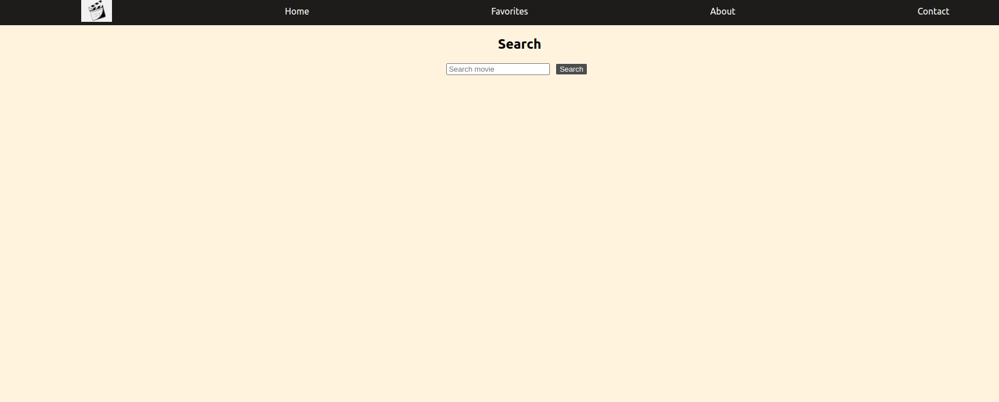
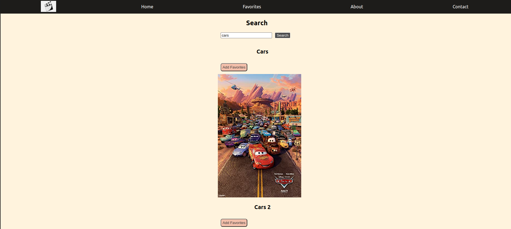
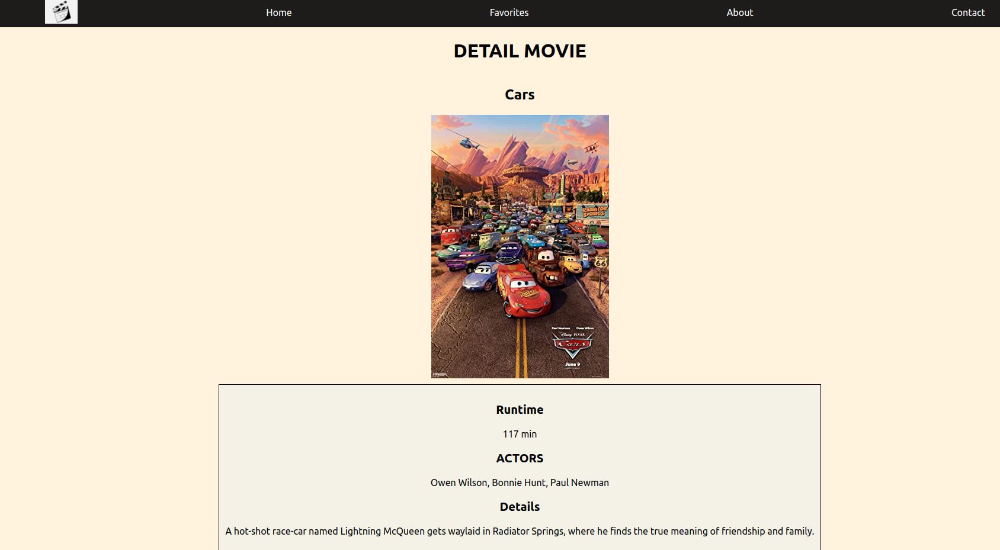
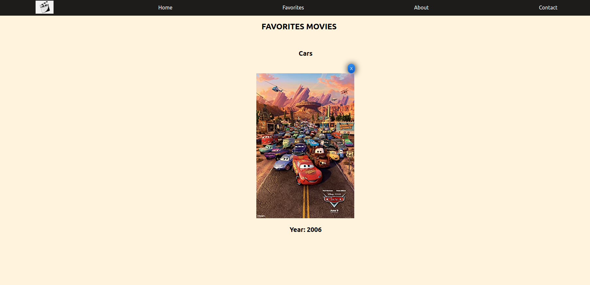

# API DE PELICULAS EN [OMDB](https://www.omdbapi.com/)

## INTRO 

### This is a small project using a movies API worked on BootCamp SoyHenry

* In this project you will:
  *  You can add to favorites
  *  You can remove the movie from your favorites
  *  You can search movies
  *  You can see details of the movie

### Initialize API:

After clone this respository.

* Open the project console
  * inside, run the command line, **npm install** then, **npm start**

### Create API for the project:

* Enter the website https://www.omdbapi.com/ and generate your APIkey

# Project Screens
## HOME

  * 

## SEARCH
  * 

## MOVIE DETAIL
  * 

## FAVORITES MOVIES
  * 